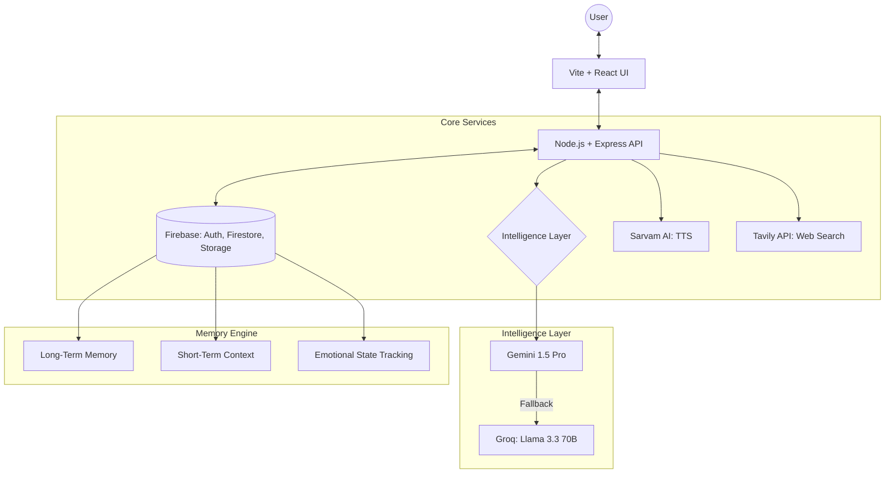

# 🌸 NYRA: Virtual Friend with a Soul

**NYRA** is a state-of-the-art AI companion designed with a persistent memory, a sassy Gen-Z personality, and real-time web awareness. Built for deep interaction and emotional intelligence.

---

## 🚀 Key Features

- **🧠 Advanced Multi-LLM Brain**: Primary reasoning via Google Gemini 1.5 Pro, with an automated high-speed fallback to Groq (Llama 3.3 70B) to ensure zero downtime.
- **💾 Persistent Memory**: Full integration with Firebase Firestore. NYRA remembers your name, your mood, and past conversations, making every interaction feel personal.
- **🌐 Real-Time Web Awareness**: Integrated with Tavily API. NYRA can search the web for the latest news, weather, or YouTube videos on command.
- **🗣️ Human-Like Speech**: High-fidelity Text-to-Speech via Sarvam AI, featuring natural Hindi/Hinglish accents with localized personas.
- **📱 3D Immersive UI**: A reactive 3D avatar layer that responds to speech, thinking states, and emotional shifts in real-time.
- **💬 Proactive Engagement**: NYRA doesn't just wait; she initiates conversations based on her memory and your shared history.

---

## 🏗️ Architecture



---

## 🛠️ Tech Stack

- **Frontend**: React, Vite, Three.js (for 3D), Axios, Tailwind/Custom CSS.
- **Backend**: Node.js, Express, Firebase Admin SDK.
- **AI/ML**: Google Generative AI, Groq SDK.
- **APIs**: Tavily (Search), Sarvam AI (Text-to-Speech).
- **Database**: Firebase Cloud Firestore (NoSQL).

---

## ⚙️ Setup & Installation

### 1. Requirements
- Node.js v18+
- Firebase Project & Service Account Key
- API Keys: Gemini, Groq, Tavily, Sarvam

### 2. Environment Configuration
Create a `.env` file in the root and backend directories:
```env
GEMINI_API_KEY=your_key
GROQ_API_KEY=your_key
TAVILY_API_KEY=your_key
SARVAM_API_KEY=your_key
```

### 3. Run Locally
```bash
# Terminal 1: Backend
cd backend
npm run dev

# Terminal 2: Frontend
cd frontend
npm run dev
```

---

## 🎨 The "Soul" Protocol
NYRA is governed by a strict personality overlay:
- **Tone**: Urban, informal, sass-heavy Gen-Z Hinglish.
- **No-Assistant Rule**: Strictly forbidden from sounding like an AI. No "Happy to help" or "As an AI model".
- **Memory First**: Every response is contextualized with the user's emotional history and identity.

---

<p align="center">Built with ❤️ by <a href="https://mdarsalan.vercel.app/">Md Arsalan</a></p>